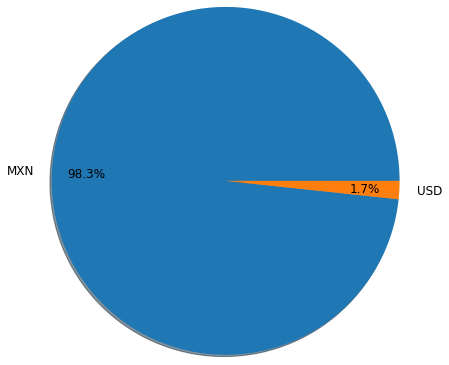
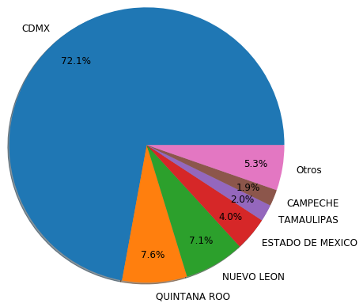
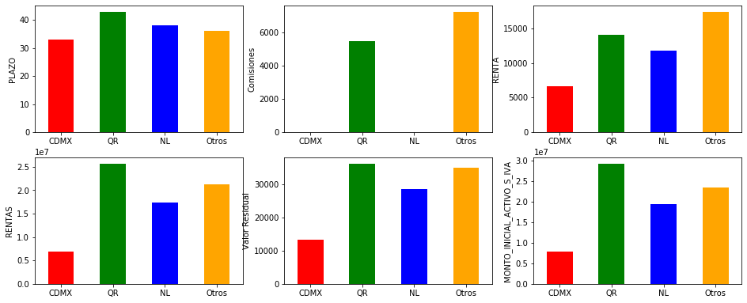

# Analisis exploratorio Challenge BOUS
En este trabajo se realiza un análisis exploratorio de un conjunto de datos con 17 variables que varian entre continuas y categóricas.

Aqui se muestra un resumen de los resultados encontrados conisderados mas relevantes. Para el análisis mas detallado, explicado y completo vease el notebook.

## Resumen del análsis exploratorio

- Las variables **periodicidad**, **tabla amortizacion**, **contrato** y **tipo de reestructura** no nos brindan informacion para el análisis
- Mas del 98\% de los contratos están en moneda nacional
  
  
- La CDMX abarca casi 3 de cada 4 contratos realizados, sin embargo el resto de las regiones tienen valores mayores en variables monetarias por contrato

  
  
- Se han hecho contratos con 383 clientes, pero solo entre 3 clientes se abarca el 50\% de los contratos
- Casi la mitad de los contratos no ofrecen comisiones
- En el año 2017 se realizaron mas del doble de contratos que el resto de los años (excepto en el 2020). Minetras que en el 2020 se realizaron mas del triple
- Los meses en los que se realizaron mas contratos fueron en Febrero y Marzo
- La variables **Rentas** y **Monto Inicial Activos** tienen una dependencia lineal entre si. 
- Los contratos por arrendamiento tienen una mediana de mas del doble que los de arrendamiento puro en todas las variables monetarias.
- El cliente principal tiene una mediana coparable con el resto de los clientes en casi todas las categorias por lo que no hay mucha diferencia entre los contratos con el cliente principal y con el resto de los clientes
